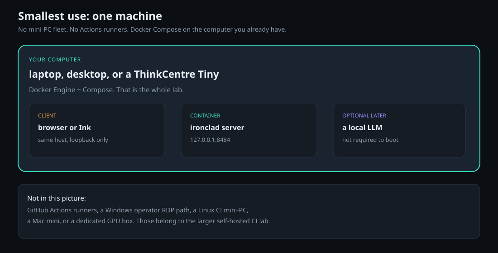

# Minimal Ironclad hardware — one machine, Docker, no runners

The **smallest** way to run Ironclad: one computer, Docker Compose, loopback API. No GitHub Actions, no mini-PC fleet, no RDP split.

Public sources will live in the `ironclad` repo. This tree is the hardware idea, not those sources.



## When to use this

| You want | Use |
|---|---|
| Try Ironclad on the PC you already own | **This repo** |
| Professional CI on Linux / Windows / macOS without hosted minutes | [self-hosted GitHub CI lab](https://github.com/GrokBuildMJW/Ironclad-AI-self-hosted-GitHub-CI) |
| A local coder or orchestrator GPU | The Spark / RTX 4090 serving recipes |

If you only need to *use* Ironclad, stop here. The CI lab is for *shipping* it.

## What you need

- One machine with **Docker Engine** and **Compose v2** (Linux, Windows, or macOS).
- A few GB of disk for the image and two volumes.
- No GPU required to start the server. A local LLM is optional and later.

That is the whole bill: electricity for one box. GitHub-hosted Actions minutes are zero because there are no Actions.

## Layout

| Piece | Where |
|---|---|
| Ironclad server | Docker container |
| API | `127.0.0.1:8484` (host loopback) |
| Workspace | Compose volume (events, vault, sessions) |
| User / tokens | Separate Compose volume |
| Config | Read-only bind, secrets only as `${env:NAME}` |
| Client | Browser or Ink **on the same machine** |
| GitHub Actions | **None** |

The container stays private until you create an auth token and publish a **loopback** port. Do not bind `0.0.0.0` unless you know the LAN story.

## Run (example)

Commands and image names come from the `ironclad` repo when it is published. The sequence is:

```text
docker compose pull
docker compose up --detach
```

The base compose file publishes **no host port**. Create the first operator token against the stopped service, store it outside git, then start with a publish override that keeps the host side on loopback:

```text
docker compose down
docker compose run --rm --no-deps server auth token create operator
# store the printed bearer once; never commit it

docker compose -f compose.yaml -f compose.publish.yaml up --detach
```

Example override (local file, not committed with a real token):

```yaml
services:
  server:
    environment:
      IRONCLAD_SERVER__BIND_HOST: 0.0.0.0
      HEALTHCHECK_BEARER_TOKEN: ${SERVER_BEARER_TOKEN:?set SERVER_BEARER_TOKEN}
    ports:
      - "127.0.0.1:8484:8484"
```

Health and the console then require `Authorization: Bearer <token>`. If the profile is missing, the server refuses to open the socket. Do not work around that with an unauthenticated proxy.

## Optional: a model on the same box

The server boots without a GPU. For a local OpenAI-compatible model later, point Ironclad at `127.0.0.1` on that box. One GPU occupant still applies: do not run two full LLMs next to this container on 8 GB laptops.

Serving recipes (separate repos): [Qwen3-Coder on RTX 4090](https://github.com/GrokBuildMJW/Qwen3-Coder-30B-A3B-Q4_K_M-llama.cpp-RTX-4090), [Flash-Next on DGX Spark](https://github.com/GrokBuildMJW/Qwen3.8-Flash-Next-NVFP4-SGLang-DGX-Spark).

## What this is not

- Not a GitHub Actions farm. See the [self-hosted CI lab](https://github.com/GrokBuildMJW/Ironclad-AI-self-hosted-GitHub-CI) if you outgrow one machine.
- Not a ThinkCentre Tiny editor workflow. That split is for people who *write* Ironclad. This split is for people who *run* it.
- Not a public image mirror and not a token store. Image path and registry credentials stay with the operator.

## License

MIT for the notes and diagrams in this tree.
